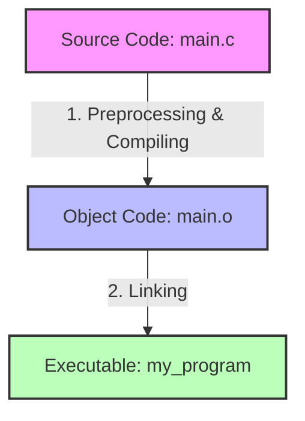

`gcc` (which stands for **GNU Compiler Collection**) is actually **both**.

While it has "Compiler" in its name, `gcc` is best understood as a **compiler driver**. When you run a single command like
`gcc main.c -o my_program`, it automatically coordinates the entire build process behind the scenes.

Here is exactly what happens under the hood when you run `gcc`:

### 1. It acts as the Compiler

First, `gcc` takes your human-readable C code and translates it into machine code. It generates an **object file** (usually
ending in `.o`).

- If you want `gcc` to _stop_ after this step and only compile, you can use the `-c` flag: `gcc -c main.c` (This outputs
  `main.o`).

### 2. It acts as the Linker

Right after compiling, `gcc` automatically calls a background linker program (usually a tool called `ld`) to bundle your
object file with standard system libraries and turn it into a final executable file.

---

### Summary

If someone asks you on a test, **`gcc` is a compiler collection that handles both compiling and linking** to take you from
raw code to a finished, runnable program in one go.
